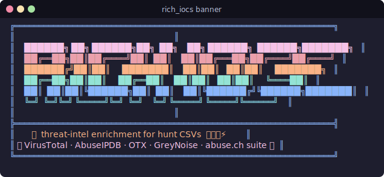
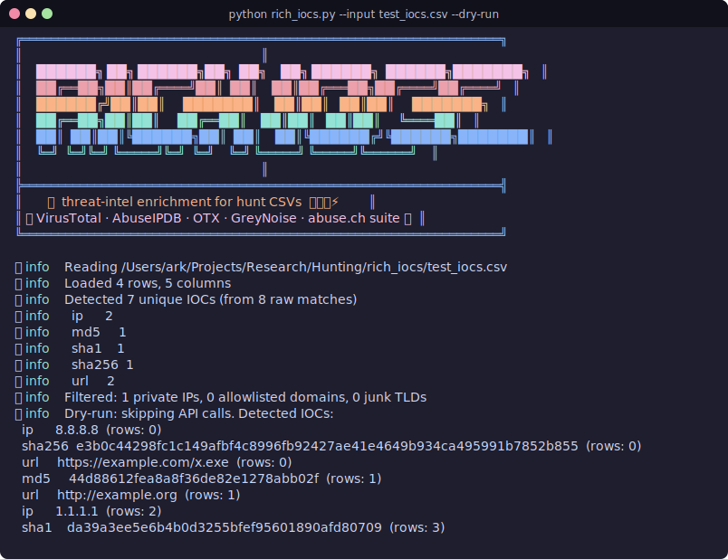

<div align="center">



# rich_iocs

**Bulk-enrich IOCs from threat-hunt CSVs against VirusTotal, AbuseIPDB, AlienVault OTX, GreyNoise, and the abuse.ch suite — in parallel, in one command.**

</div>

---

`rich_iocs` takes a CSV from your SIEM, XDR, or hunt platform — wherever your indicators live — auto-detects every IP, domain, URL, and MD5/SHA1/SHA256 hash inside it, refangs anything defanged, drops the noise (private IPs, Microsoft/Google domains, "filenames" mis-detected as domains), then fires the unique IOCs at seven threat-intel APIs in parallel and gives you back three artifacts ready for triage.

**Built for analysts who triage hunt output and want to stop opening 30 browser tabs per IOC.**

## What you get

| Output | Purpose |
| --- | --- |
| `out/enriched.csv` | Original CSV rows with appended enrichment columns — open in Excel/Google Sheets |
| `out/json/<type>/<ioc>.json` | Full raw API responses, one file per IOC, for deep dives |
| `out/report.md` | Markdown triage summary — top findings, errors, skipped IOCs |

## Sources

| Source | IOC types | Key required |
| --- | --- | --- |
| VirusTotal v3 | ip, domain, url, md5, sha1, sha256 | ✅ |
| AbuseIPDB | ip | ✅ |
| AlienVault OTX | ip, domain, url, md5, sha1, sha256 | ✅ |
| GreyNoise (community) | ip | ⚪️ optional |
| Malware Bazaar (abuse.ch) | md5, sha1, sha256 | ✅ |
| URLhaus (abuse.ch) | url, domain | ✅ |
| ThreatFox (abuse.ch) | all six | ✅ |

abuse.ch services share **one** Auth-Key.

## Install

```bash
git clone <your-repo-url> rich_iocs
cd rich_iocs
python3 -m venv .venv
source .venv/bin/activate
pip install -r requirements.txt
cp .env.example .env       # then fill in your keys
```

Requires Python 3.10+. Two runtime dependencies: `requests`, `python-dotenv`.

## Quick start

```bash
# 1. Dry run — zero API calls, just verify which IOCs come out
python rich_iocs.py --input hunt.csv --dry-run

# 2. Full run with all enabled sources
python rich_iocs.py --input hunt.csv --output-dir ./out
```

<div align="center">



*Sample dry-run against the bundled `test_iocs.csv` fixture.*

</div>

## Common workflows

### Constrain detection to specific columns

If your CSV is structured (e.g. `SourceIP`, `FileHash`), pin those columns to avoid false positives in free-text fields:

```bash
python rich_iocs.py --input hunt.csv \
    --ip-col SourceIP \
    --hash-col FileHash \
    --output-dir ./out
```

Any IOC type without a column constraint is still auto-detected across all cells.

### Pick or skip sources

```bash
# Only hit VirusTotal and GreyNoise
python rich_iocs.py --input hunt.csv --only-sources vt,greynoise

# Skip OTX (e.g. when you're missing the key)
python rich_iocs.py --input hunt.csv --skip-sources otx
```

### Tune rate limits

Defaults match free tiers. Override per source:

```bash
python rich_iocs.py --input hunt.csv \
    --vt-rpm 4 \
    --abuseipdb-rpm 45 \
    --otx-rpm 60
```

Each source runs in its own thread with its own token bucket — VT's 4-rpm spacing **does not** block AbuseIPDB or OTX. Total runtime is bounded by the slowest enabled lane.

> **Heads up — VT free tier dominates wall-clock time.** At 4 rpm, 50 IOCs through VirusTotal takes ~12 minutes; everything else finishes in seconds. The tool logs per-IOC progress (see below), so you can confirm the workers are alive while VT grinds through its queue. If you have a paid VT key, bump `--vt-rpm` accordingly.

### What a live run looks like

Each source logs per-IOC progress so slow lanes (notably VT free at 4 rpm) don't look like a hang:

```
🛡️ info     [vt] starting 7 IOC(s) @ 4 rpm
🛡️ info     [greynoise] starting 2 IOC(s) @ 30 rpm
🛡️ info     [greynoise] 1/2 ip 8.8.8.8  classification=benign
🛡️ info     [otx] 1/7 ip 8.8.8.8  pulses=0
🛡️ info     [abuseipdb] 1/2 ip 8.8.8.8  score=0 reports=0
🛡️ info     [vt] 1/7 ip 8.8.8.8  clean
...
🛡️ info     [greynoise] done: ok=2 not_found=0 error=0 skipped=0
🛡️ info     [vt] done: ok=7 not_found=0 error=0 skipped=0
```

Errors log at WARNING level with the source, IOC, and reason — so a flapping API never disappears silently into the report.

### Extend the skip-list

The built-in lists drop private/loopback IPs and common enterprise domains (`microsoft.com`, `google.com`, `cloudflare.com`, ...). Add your own:

```bash
python rich_iocs.py --input hunt.csv \
    --skip-domains-file my-allowlist.txt \
    --skip-ips-file my-skip-ips.txt
```

One entry per line. Comments (`#`) and blank lines are ignored.

## All flags

```
--input / -i              required    Input CSV file
--output-dir / -o         ./out       Output directory
--ip-col / --domain-col / --url-col / --hash-col
                                      Restrict detection of that IOC type to a single column
--only-sources LIST                   Comma-separated source names (overrides --skip-sources)
--skip-sources LIST                   Comma-separated source names to skip
--skip-domains-file PATH              Additional allowlisted domains (one per line)
--skip-ips-file PATH                  Additional skip IPs (one per line)
--vt-rpm N                4           VirusTotal requests per minute
--abuseipdb-rpm N         45          AbuseIPDB
--otx-rpm N               60          AlienVault OTX
--greynoise-rpm N         30          GreyNoise community
--abusech-rpm N           60          Shared across MB / URLhaus / ThreatFox
--abuseipdb-max-age N     90          AbuseIPDB maxAgeInDays
--max-workers N           # sources   Thread pool size
--sequential                          Disable concurrency (debugging)
--dry-run                             Detect + filter only, no API calls
--timeout SECONDS         20          Per-request read timeout
--env-file PATH           .env        dotenv file path
--color {auto,always,never}
--no-banner                           Suppress the startup banner
--verbose / -v                        Debug logs
```

Source names: `vt`, `abuseipdb`, `otx`, `greynoise`, `mb` (Malware Bazaar), `urlhaus`, `threatfox`.

## How detection works

1. **Refang** every cell first: `1.1.1[.]1` → `1.1.1.1`, `hxxps://` → `https://`, `[at]` → `@`.
2. **Hash precedence**: SHA256 → SHA1 → MD5. Longer hashes are extracted before shorter regexes run, so a SHA256 isn't double-counted as a substring MD5.
3. **URL before domain**: URLs are extracted first; the domain regex scans what remains, so `https://evil.example/login` becomes one URL — not URL + domain.
4. **IP filtering**: drop anything matching `is_private`, `is_loopback`, `is_link_local`, `is_multicast`, `is_reserved`, or `is_unspecified`.
5. **Domain filtering**: suffix-match against a built-in enterprise allowlist plus your `--skip-domains-file`. Also reject "domains" whose right-most label is a known file extension (`.exe`, `.dll`, `.config`, `.txt`, ...).
6. **Canonicalize + dedupe**: lowercase domains/hashes, strip trailing slashes on URLs, dedupe by `(type, value)`. Each IOC is queried once even if it appears in 50 rows.

## What gets written to the CSV

The original CSV passes through untouched. New columns are appended:

```
ioc_count, ioc_types,
vt_malicious, vt_suspicious, vt_reputation, vt_link,
abuseipdb_score, abuseipdb_reports, abuseipdb_country, abuseipdb_isp, abuseipdb_link,
otx_pulse_count, otx_first_pulse, otx_link,
gn_classification, gn_name, gn_last_seen, gn_link,
mb_signature, mb_file_type, mb_tags, mb_first_seen, mb_link,
urlhaus_threat, urlhaus_status, urlhaus_tags, urlhaus_url_count, urlhaus_blacklists, urlhaus_link,
threatfox_threat, threatfox_malware, threatfox_confidence, threatfox_hits, threatfox_link,
enrichment_errors
```

Rows containing multiple IOCs aggregate per-source values with `;` as the separator.

## Caching

Intentionally **no cache** — every run hits the APIs fresh. The per-IOC JSON files passively archive each query, but they aren't read back on subsequent runs. If you re-run the same CSV often, copy `out/json/` aside before the next run, or wire up a `--reuse-json` layer.

## Error handling

`rich_iocs` is designed never to crash mid-run.

| Condition | Behavior |
| --- | --- |
| 401 / 403 from any source | That source is disabled for the rest of the run; final log line names every disabled source. |
| 429 (rate-limited) | Honor `Retry-After` (capped at 60s so a misbehaving server can't pause the run), else exponential backoff (2s → 4s → 8s), max 3 retries. |
| 5xx / connection timeout | Exponential backoff (1s → 2s → 4s), max 3 retries. |
| Anything else | Per-IOC result marked `status="error"`, reason recorded in `enrichment_errors` and `out/report.md`. |

One bad key or a flaky API does not stop the other sources.

## Verification (smoke test)

Bundled `test_iocs.csv` covers refang, private-IP filter, and hash length precedence:

```bash
# Zero quota cost — verifies detection + filtering.
python rich_iocs.py --input test_iocs.csv --dry-run

# Live single-source test (free, no key required).
python rich_iocs.py --input test_iocs.csv -o ./out --only-sources greynoise
```

Expected dry-run result: `192.168.1.50` filtered (private), and detected: 2 public IPs (`8.8.8.8`, `1.1.1.1`), SHA256 + SHA1 + MD5, and 2 URLs (refanged from `hxxps://example[.]com/x.exe` and `http://example.org/`).

## Repository layout

```
rich_iocs/
├── rich_iocs.py          # CLI entrypoint + orchestration
├── iocs.py               # IOC detection, refang, filter, dedupe
├── config.py             # .env loading + per-source config
├── ratelimit.py          # Token bucket
├── enrichers/
│   ├── base.py           # ABC, retry/backoff, error handling
│   ├── virustotal.py
│   ├── abuseipdb.py
│   ├── otx.py
│   ├── greynoise.py
│   └── abusech.py        # MB + URLhaus + ThreatFox (shared auth)
├── writers.py            # Enriched CSV, JSON, markdown report
├── scripts/
│   ├── ansi_to_svg.py    # ANSI → SVG converter for docs/*.svg
│   └── regen_screenshots.py  # One-shot to regenerate both screenshots
├── docs/
│   ├── banner.svg
│   └── dry-run.svg
├── test_iocs.csv         # Smoke-test fixture
├── requirements.txt
├── .env.example
└── README.md
```

## Regenerating the screenshots

The `docs/*.svg` files are produced by `scripts/regen_screenshots.py`, which captures the banner and a `--dry-run` invocation, then renders both via `scripts/ansi_to_svg.py`.

```bash
python scripts/regen_screenshots.py
```

Edit `scripts/regen_screenshots.py` (titles, terminal column widths) if you want to tweak the output.

## Guardrails

- **AI drafts, humans run.** Every IOC enrichment is suggestive, not authoritative. Always corroborate with at least one additional source before acting on findings.
- API keys live in `.env` — never commit them. The shipped `.gitignore` (if you add one) should exclude `.env` and `out/`.
- Be mindful of free-tier quotas. VT free tier is 4 req/min and 500 req/day — `--dry-run` is your friend before kicking off a 5,000-row CSV.
